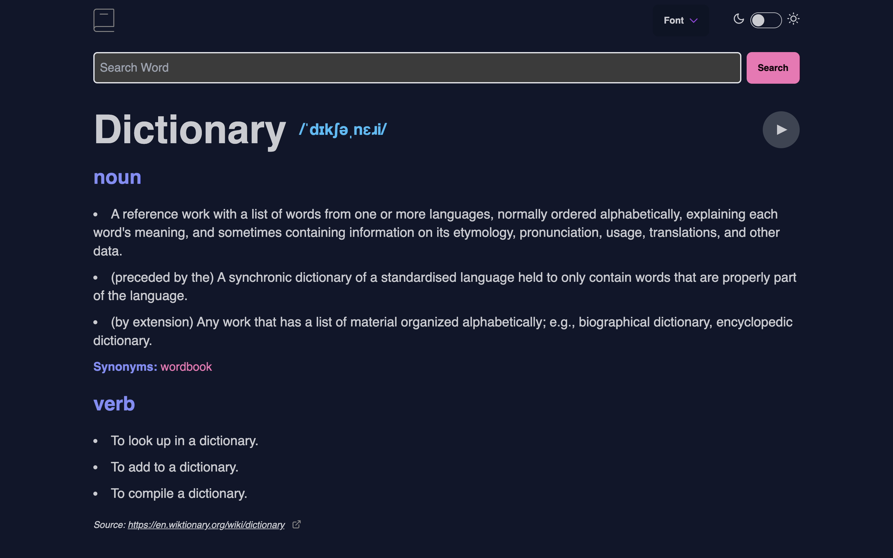

# Word Search Dictionary App

This project is a simple word search dictionary app built as a solution to a frontend mentor project. It was my first React project where I had the opportunity to work with an external API. My main goal for this project was to understand state management and API requests within a React application.

## Features

- **Word Search**: Search for definitions of words.
- **API Integration**: Utilizes an external API to fetch word definitions.
- **Responsive Design**: Built with mobile-first design principles using Tailwind CSS.
- **Easy Setup**: Developed using Vite, a fast build tool for modern web development.

## Technologies Used

- **React**: A JavaScript library for building user interfaces.
- **Vite**: A fast build tool that leverages modern JavaScript tooling for frontend development.
- **Tailwind CSS**: A utility-first CSS framework for rapidly building custom designs.
- **[External API Name]**: Used [Name of API] to fetch word definitions.

